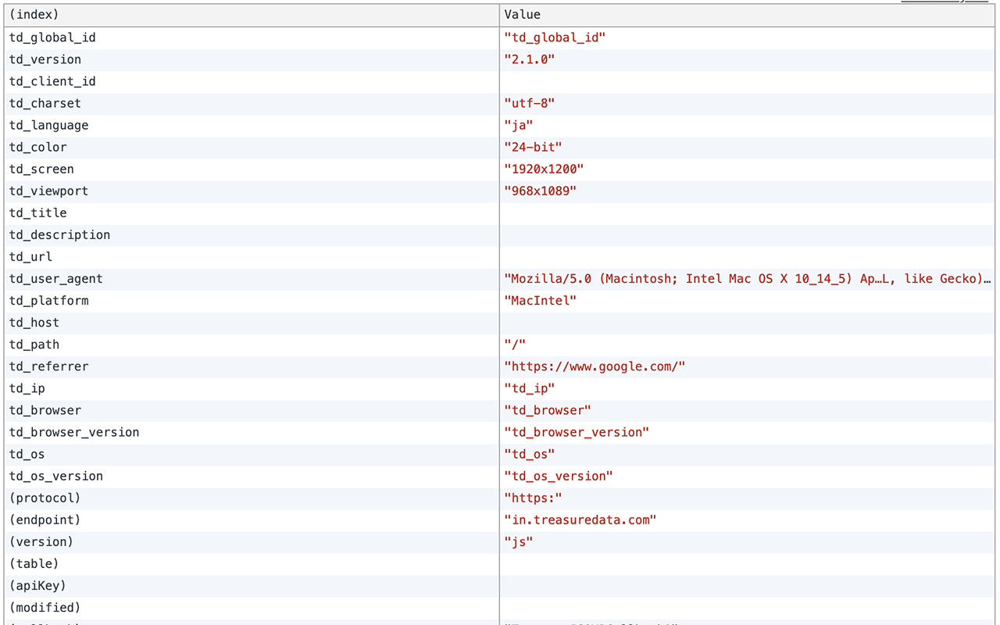

# Treasure Data TD-JS-SDK Chrome用 デバッガー

[English document available here / 英語のドキュメントはこちら](./README.md)

## これは何?
- Treasure Data のTD-JS-SDKのビーコンをデバッグするためのChrome機能拡張です
- この機能拡張はChromeのデベロッパーツールのコンソールタブ内で、Treasure Dataに送られている情報を表形式で表示します
- Chromeの機能拡張ページでこの機能拡張の有効/無効を切り替えられます

## インストール方法

### A. パッケージ化済みファイルを読み込む (Chrome 80で廃止)
1. パッケージ化された機能拡張、 `td-chrome-debugger.crx` をダウンロードします
2. Chromeの機能拡張ページを開きます
3. `td-chrome-debugger.crx` をChromeのウィンドウにドラッグ＆ドロップします

### B. 非パッケージ状態からインストールする
1. このリポジトリをクローンするかダウンロードします
2. Chromeの機能拡張ページを開きます
3. 「デベロッパーモード」を有効にします
4. 「パッケージ化されていない機能拡張を読み込む」をクリックし、コンピュータ上のこのソースコードのあるディレクトリを指定します

## 利用法
1. デベロッパーツールを開き、Consoleタブに切り替えます
2. 実装をデバッグしたいウェブサイトを開いてください
