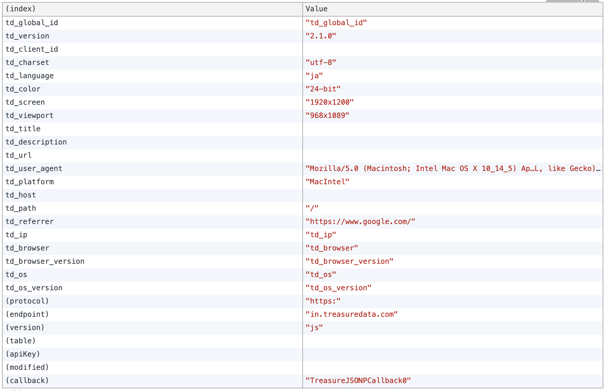

# Treasure Data TD-JS-SDK debugger for Chrome

## What is this?
- A Chrome Extension for debugging Treasure Data's TD-JS-SDK web beacons.
- In Console tab of Chrome's developer tool, the extension shows a table of payload sent to Treasure Data.
- You can toggle on/off the extension through Chrome's Extension page.

## Installation

### A. Install the packaged file
1. Download the packaged extension `td-chrome-debugger.crx`.
2. Open Chrome's extension page.
3. Drag & drop `td-chrome-debugger.crx` to the Chrome window.

### B. Install from un-packaged files
1. Clone or Download this repository.
2. Open Chrome's extension page.
3. Enable "Developer Mode".
4. Click "Load Unpackaged Extension" and point a directory of this source code on your computer.

## Usage
1. Open the Developer Tool and go to Console tab.
2. Open a website you want to debug the implementation of TD-JS-SDK.
